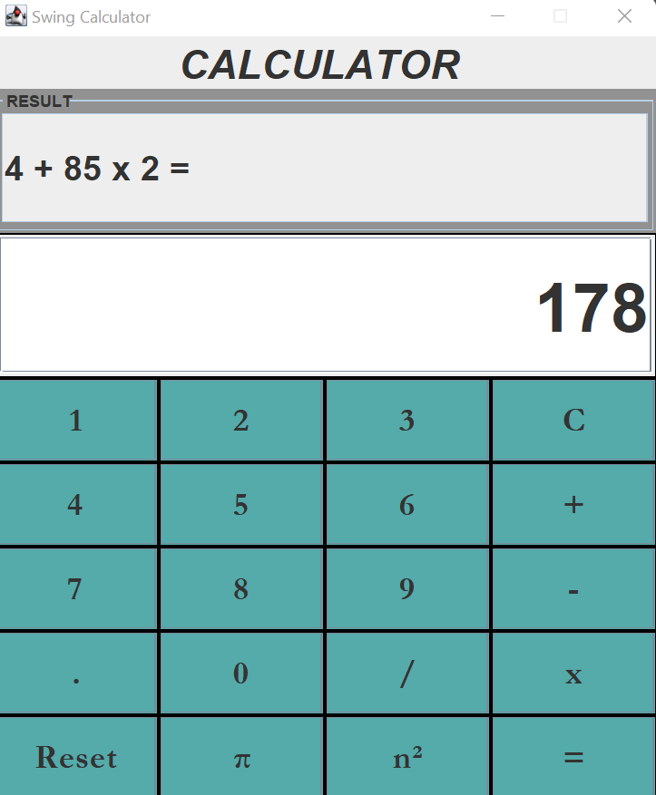

# Calculator-using-Java

This is a simple project implemented using Java and Java Swings to perform various arithmetic operations like addition, division, 
subtraction, multiplication as well as calculating square of a number. A simple and easy to use UI was designed using Java Swings for performing the above operations on Graphical User Interface.

Output

